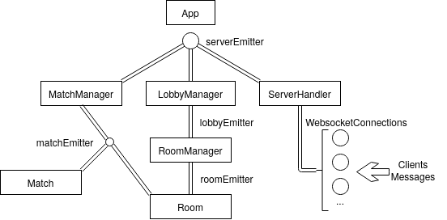

# LULChess Server Implementation

---
---

## Documentation

---

## 1. API Documentation

---

### Sends

- `"uID"`, sent when connection is stablished.

    This message is followed by the user session ID - string.

- `"activeRooms"`, as an aswer to `"getActiveRooms"`.

    This message is followed by an array of objects. Each object contains
    information of each active room.

- `"createdRoom"`, as an answer to `"createMatch"`.

    This message is followed by the roomID of the room created - int.

- `"notCreated"`, as an answer to `"createMatch"`.

    This message is sent by itself. It signals the client that it could not
    create the desired room. It usually indicates that the server is full.

- `"leftRoom"`, as an answer to `"leaveRoom"`.

    This message is sent by itself. It signals the client that it succesfully
    left the room, allowing it to join another.

- `"joined"`, as an answer to `"tryJoin"`.

    This message is followed by the roomID of the room the client joined - int.

- `"notJoin"`, as an answer to `"tryJoin"`.

    This message is sent by itself. It signals that there was a problem joining
    the requested room. Usually it means the room became full or was deleted in
    the meantime.

---

### Interprets

- `"getPieces"`: The client asks for the pieces available for matches.

    Supply the pieces and their actions in order to allow client implementions
    to provide in-match features. One example is showing where each piece can
    move in a given state.

- `"createMatch"`: The client submits a form containing match params and asks
    for a room.

- `"getActiveRooms"`: The client requests a list of active room.

    This allows the client to display a lobby.

- `"leaveRoom"`: The client tells it left the current room.

- `"tryJoin"`: The client submits a roomID and asks to join the respective
    room

---
---

## 2. Handling Client Requests

